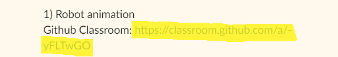
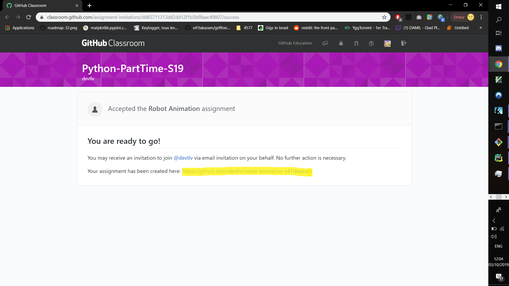

# How to submit a Github Classroom assignment

**Step 1: Get the url of the Github Classroom assignment**

Get this URL from your teacher, and then navigate to this link.

**Step 2: Create a repository**

When you get on the Github Classroom link, a repository will automatically be created, the link will be displayed on the page.

Copy it !

**Step 3: Open the repository in Git Kraken**

> You can open it with any git manager.

In Git Kraken, select `Clone a repo`.

**Step 4: Clone the repository**

This panel should be opened when you click `Clone a repo`.

Fill those fields:

(1) Browse to the folder where you want to download the project 

> Suggestion: Put it in the "PythonCourse" folder, under "Homework" sub-folder.

(2)  Paste the repository url that you copied in step 2.

(3) Clone !

**Step 5: Navigate to your the repository folder**

Navigate with your file explorer to the folder. 

> You can hit *Alt+o* to open it directly

**Step 6: Do the exercise**

Modify/Create the files and finish the exercise

**Step 7: Go to your changed files on Git Kraken**

Click "View Change" on the Git Kraken.

**Step 8: Stage the files**

You can click "Stage" on the files you want to upload, or "Stage all changes" to upload everything.

**Step 9: Commit your changes**

Save your changes to your repository, add a comment and click "Commit changes to files"

**Step 10: Push to remote repository**

To update the remote repository, click "Push"

